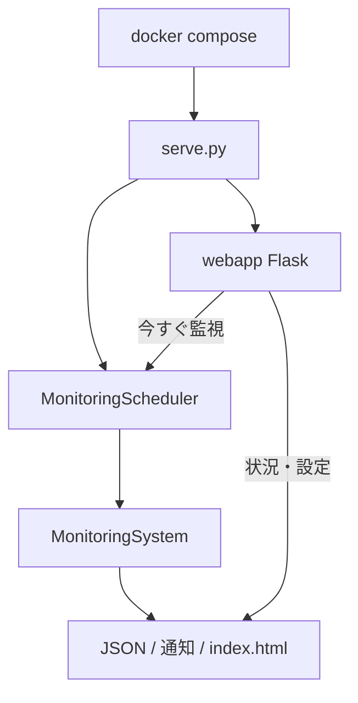

# アーキテクチャ概要

BeaconBase は設定に基づき死活・容量・コンテナ・Web を監視し、JSON・通知・WEB UI で結果を見せる。
推奨の起動形態は docker compose による常駐プロセス（定期監視 + WEB）である。

## モジュール構成

| モジュール | 役割 |
|------------|------|
| `serve.py` | 常駐エントリ（スケジューラ + WEB） |
| `scheduler.py` | `check_interval` ごとの監視ループ |
| `webapp/` | 状況表示・設定編集の Flask アプリ |
| `config_manager.py` | WEB からの設定ファイル読み書き |
| `monitor.py` | CLI（都度実行・検証） |
| `beaconbase.py` | `MonitoringSystem` 本体 |
| `config_loader.py` | YAML 読込と `includes_dir` マージ |
| `status_store.py` | 連続失敗と障害継続の状態 |
| `alerts.py` | alerts.log と Webhook / メール / コマンド |
| `dashboard.py` | `index.html` の生成 |
| `exceptions.py` | `MonitoringError` / `RetryableError` |

`MonitoringSystem` 自体は機能別に分割していない。

## 処理フロー（常駐）

1. コンテナ起動時、必要なら `/data` にサンプル設定を展開する
2. スケジューラが設定を読み、間隔ごとに `run_all_checks` を実行する
3. 結果を保存し、状態・通知・`index.html` を更新する
4. WEB は `latest.json` を表示し、設定 YAML の編集と手動実行を受け付ける

CLI（`monitor.py`）は同じ `MonitoringSystem` を1回だけ実行して終了する。

## Ping とポート

Ping は ICMP（ping3）のあと、権限不足なら OS の `ping` へフォールバックする。ポート監視は TCP 接続のみである。

## ディスク

SSH 上で `df -P` を実行し、tmpfs などを除いた最大使用率で WARNING / ERROR を付ける。

## Docker ヘルス判定

コンテナ状態は `docker inspect` の Health を優先し、無い場合は `docker ps` の Status から判定する。

## 通知判定

`StatusStore` が項目ごとに連続失敗を数える。`alerts.fail_count` に達したら down、OK に戻ったら recover。

## 設定の詳細

分割設定は [configuration.md](configuration.md)。運用手順は [operations.md](operations.md)。
