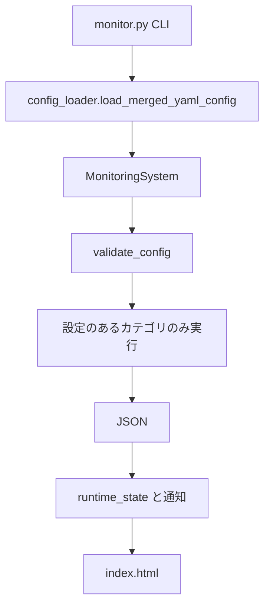

# アーキテクチャ概要

BeaconBase は CLI から設定を読み込み、死活・容量・コンテナ・Web を実行し、JSON と HTML ダッシュボード、必要なら通知を出す。監視セクションは任意であり、設定のあるカテゴリだけを実行する。

## モジュール構成

| モジュール | 役割 |
|------------|------|
| `monitor.py` | CLI（引数、定期実行、ダッシュボード HTTP） |
| `beaconbase.py` | `MonitoringSystem` 本体、`CheckStatus` / `CheckResult` |
| `config_loader.py` | YAML 読込と `includes_dir` マージ |
| `exceptions.py` | `MonitoringError` / `RetryableError` |
| `status_store.py` | 連続失敗と障害継続の状態 |
| `alerts.py` | alerts.log と Webhook / メール / コマンド |
| `dashboard.py` | `index.html` の生成 |

`beaconbase` は例外と `load_merged_yaml_config` を再エクスポートするため、既存の `from beaconbase import MonitoringSystem, MonitoringError` はそのまま使える。`MonitoringSystem` 自体は機能別に分割していない。

## 処理フロー

1. CLI が設定パスと `--only` / `--interval` / `--serve` を受け取る
2. 設定をマージし、書かれているセクションを検証する
3. 対象カテゴリを並列実行する。定期実行ではログ収集を既定で除外する
4. サマリー JSON を書き、状態ファイルを更新して通知イベントを出す
5. ダッシュボードを書き、古い日次 JSON を削除する

## Ping とポート

Ping は ICMP（ping3）のあと、権限不足なら OS の `ping` へフォールバックする。ポート監視は TCP 接続のみで、ICMP が塞がっていてもサービスの待ち受けを確認できる。

## ディスク

SSH 上で `df -P` を実行し、tmpfs などを除いた最大使用率で WARNING / ERROR を付ける。

## Docker ヘルス判定

コンテナ状態は `docker inspect` の Health を優先し、無い場合は `docker ps` の Status 文字列から判定する。`health_check_url` がある場合は Docker ホスト上で curl し、FAIL なら ERROR にする。

## 通知判定

`StatusStore` が項目ごとに連続失敗を数える。`alerts.fail_count` に達したら down、OK に戻ったら recover、一定時間落ちたままなら remind。`--only` で走っていないカテゴリの状態は消さない。

## 終了コード

ERROR は常に失敗（終了コード 2）。ログ収集の NOT_FOUND は失敗にしない。`--interval` 中は 2 でプロセスを終えず、次の周期を待つ。

## 設定の詳細

分割設定は [configuration.md](configuration.md)。運用手順は [operations.md](operations.md)。
