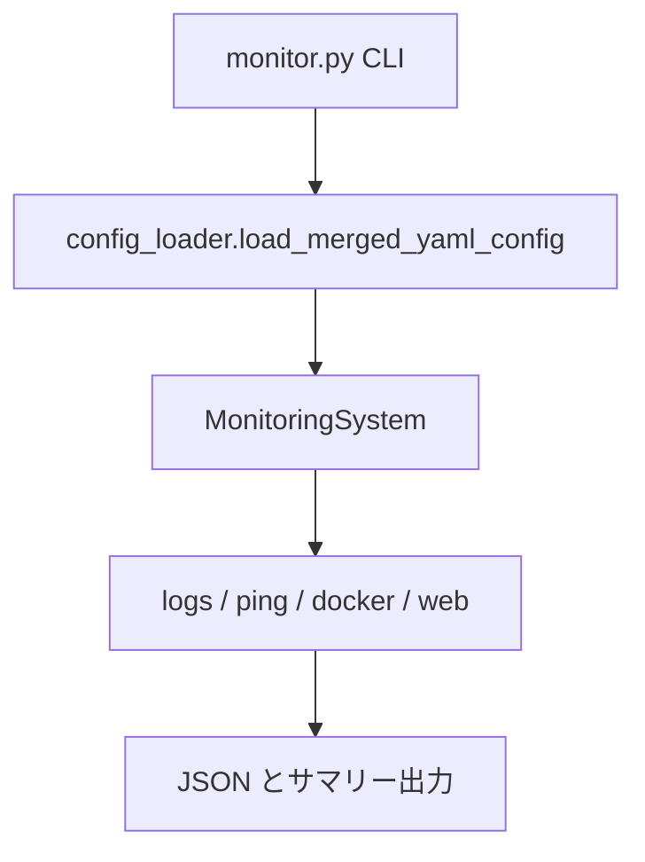

# アーキテクチャ概要

BeaconBase は CLI から設定を読み込み、ログ収集・Ping・Docker・Web ヘルスを実行し、結果を JSON / サマリーとして出力します。

## モジュール構成

| モジュール | 役割 |
|------------|------|
| `monitor.py` | CLI（引数解析、終了コード） |
| `beaconbase.py` | `MonitoringSystem` 本体、`CheckStatus` / `CheckResult` |
| `config_loader.py` | YAML 読込と `includes_dir` マージ |
| `exceptions.py` | `MonitoringError` / `RetryableError` |

`beaconbase` は例外と `load_merged_yaml_config` を再エクスポートするため、既存の `from beaconbase import MonitoringSystem, MonitoringError` はそのまま使えます。

## 処理フロー

1. CLI が設定パスを受け取り `MonitoringSystem` を生成する
2. `load_merged_yaml_config` がメイン YAML と `includes_dir` をマージする
3. `validate_config` で必須セクションを検証する
4. `run_all_checks` が各監視を実行し、カテゴリごとに結果を保存する
5. 監視サマリー / エラーサマリーを出力フォルダへ書く

## Docker ヘルス判定

コンテナ状態は `docker inspect` の Health を優先し、無い場合は `docker ps` の Status 文字列から判定します。判定ロジックは `MonitoringSystem._status_from_container_status` に集約しています。

| Health / Status | CheckStatus |
|-----------------|-------------|
| healthy | OK |
| unhealthy | ERROR |
| starting | WARNING |
| NOT_FOUND | NOT_FOUND |
| Up（Health なし） | OK |

## 設定の詳細

分割設定の仕様は [configuration.md](configuration.md) を参照してください。
