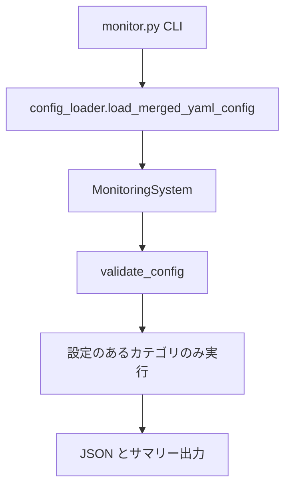

# アーキテクチャ概要

BeaconBase は CLI から設定を読み込み、ログ収集・Ping・Docker・Web ヘルスを実行し、結果を JSON / サマリーとして出力する。監視セクションは任意であり、設定のあるカテゴリだけを実行する。

## モジュール構成

| モジュール | 役割 |
|------------|------|
| `monitor.py` | CLI（引数解析、終了コード、コンソールサマリー） |
| `beaconbase.py` | `MonitoringSystem` 本体、`CheckStatus` / `CheckResult` |
| `config_loader.py` | YAML 読込と `includes_dir` マージ |
| `exceptions.py` | `MonitoringError` / `RetryableError` |

`beaconbase` は例外と `load_merged_yaml_config` を再エクスポートするため、既存の `from beaconbase import MonitoringSystem, MonitoringError` はそのまま使える。

## 処理フロー

1. CLI が設定パスと `--only` / `--validate` を受け取り `MonitoringSystem` を生成する
2. `load_merged_yaml_config` がメイン YAML と `includes_dir` をマージする
3. `~` を展開した出力ディレクトリを作成し、`validate_config` で書かれているセクションを検証する
4. `run_all_checks` が対象カテゴリを並列実行する（カテゴリ全体に短いタイムアウトは掛けない）
5. カテゴリ内の Ping / Web は `max_workers` で並列化する
6. `check_summary.json` / `error_summary.json` を出力する。エラーが無ければ後者は削除する

## Ping

ICMP（ping3）を試し、権限不足などで結果が得られない場合は OS 標準の `ping` コマンドにフォールバックする。ping3 がタイムアウト（False）を返した場合は到達不能とみなす。

## Docker ヘルス判定

コンテナ状態は `docker inspect` の Health を優先し、無い場合は `docker ps` の Status 文字列から判定する。判定ロジックは `MonitoringSystem._status_from_container_status` に集約している。`health_check_url` がある場合は Docker ホスト上で curl し、FAIL なら ERROR にする。

| Health / Status | CheckStatus |
|-----------------|-------------|
| healthy | OK |
| unhealthy | ERROR |
| starting | WARNING |
| NOT_FOUND | NOT_FOUND |
| Up（Health なし） | OK |
| HTTP ヘルスチェック FAIL | ERROR |

## 終了コード

ERROR は常に失敗（終了コード 2）。ログ収集の NOT_FOUND は失敗にしない。Docker など他カテゴリの NOT_FOUND は失敗とみなす。WARNING だけでは 0 で終了する。

## 設定の詳細

分割設定の仕様は [configuration.md](configuration.md) を参照する。
